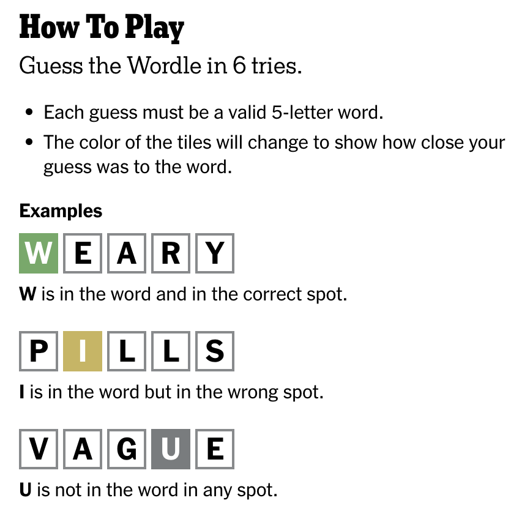

# Wordle Recreation!

I am Recreating the classic game "[Wordle](https://www.nytimes.com/games/wordle/index.html)" for my University Project

## How to setup (Linux/Mac)

Clone the repo:

`gh repo clone tarunsreedhars/WordleRecreation`

Go inside:

`cd WordleRecreation`

Requirements:

`pip install -r requirements.txt`

Run:

`python main.py`

Enjoy the game.

## How to play

## Technical background

The game is based on [pygame](https://www.pygame.org/).

## License

(c) 2024 Tarun Shakthi Sreedhar, Shomesh Mishra and Venkata Naresh Vemparala

Distributed under the conditions of the MIT License. See LICENSE.TXT for details.
